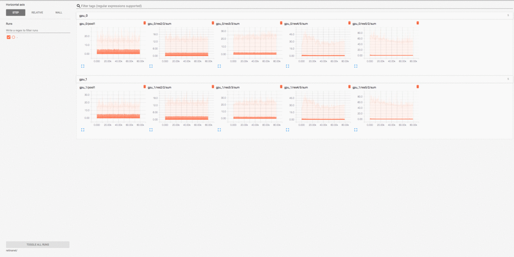

# c2board

A hacked-up visualization tool for [caffe2](https://caffe2.ai/). Specifically, it dumps the computation graph and the training statistics of caffe2 into a [tensorboard](https://www.tensorflow.org/programmers_guide/summaries_and_tensorboard) compatible format. Once it starts dumping, you can use tensorboard to visualize the results.

### Prerequisites

- Caffe2.
- Tensorboard. The code is meant to be standalone, so that you do not need to import **both** [tensorflow](https://www.tensorflow.org/) and caffe2 at the same time -- unexpected behaviors can occur. However, tensorboard needs to be installed somewhere (like in another [conda environment](https://conda.io/docs/user-guide/tasks/manage-environments.html)) for visualization, otherwise the dumped information is not useful by itself.
- Python libraries:
  ```Shell
  # for conda users
  conda install protobuf
  # or for ubuntu: sudo apt-get install protobuf-compiler libprotobuf-dev
  pip install json numpy Pillow six threading
  ```

### Installation

1. Clone the repository
  ```Shell
  git clone https://github.com/endernewton/c2board.git
  ```
2. Make and install it locally
  ```Shell
  cd c2board
  make
  ```

### Usage

- For graph visualization, you can follow `demo_graph.py`. The main function to call is `writer.write_graph`, which accepts either a `CNNModelHelper`, or `Net`, or `NetDef` object to visualize.
- Training statistics can be divided into two types:
  - First, for scalars, they are usually loss, current iteration pre-computed, therefore we can directly store them without any additional effort. The relevant function to call is `writer.write_scalars(dict, iter)` where `dict` is the dictionary of the scalars, and `iter` the current iteration.
  - Second, for histograms and images, we need to call the `workspace.FetchBlob` function to fetch the values. For those, we first use `writer.append_histogram(name)` or `writer.append_image(name)` to build the list of blobs we are interested in when building up the graph. Then, during training we only need to call `writer.write_summaries(iter)` and the underlying method will take care of fetching blobs, computing histograms, etc.
- When it starts dumping, you can just use the normal `tensorboard` command line to visualize things.

### Screen shots

These screen shots are taken when training a detector with [detectron](https://github.com/facebookresearch/Detectron).


### References

- [tensorboard-pytorch](https://github.com/lanpa/tensorboard-pytorch) to make tensors flow without tensorflow.
- [caffe2-native tensorboard](https://github.com/caffe2/caffe2/tree/master/caffe2/contrib/tensorboard) to visualize graphs.
